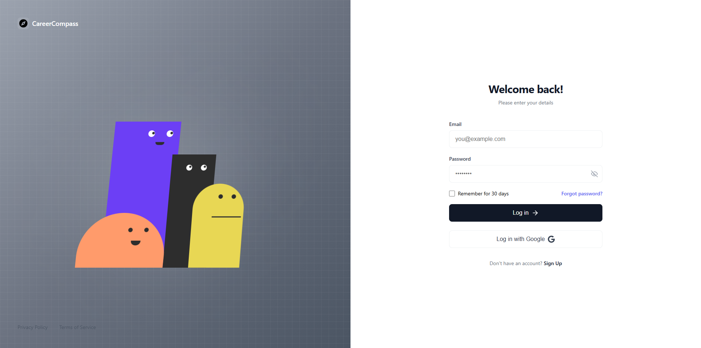
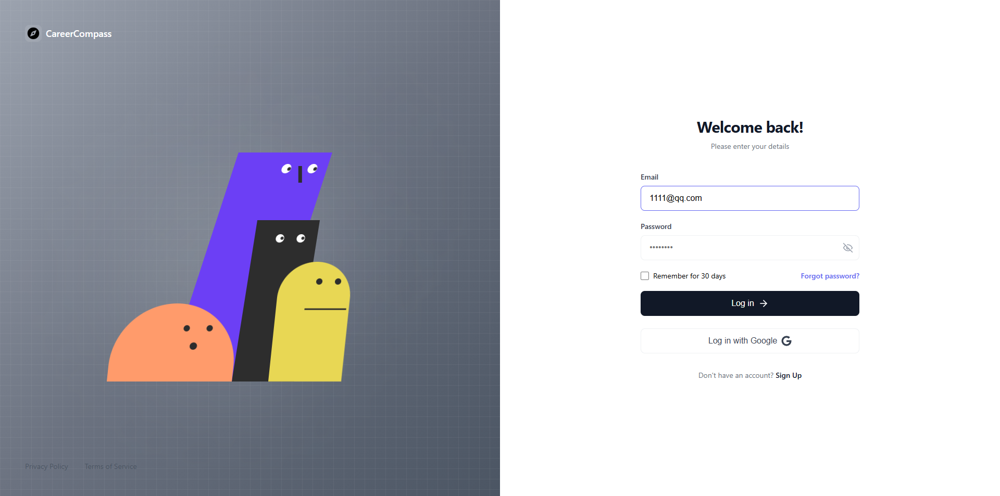
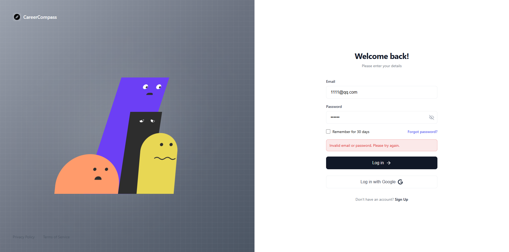
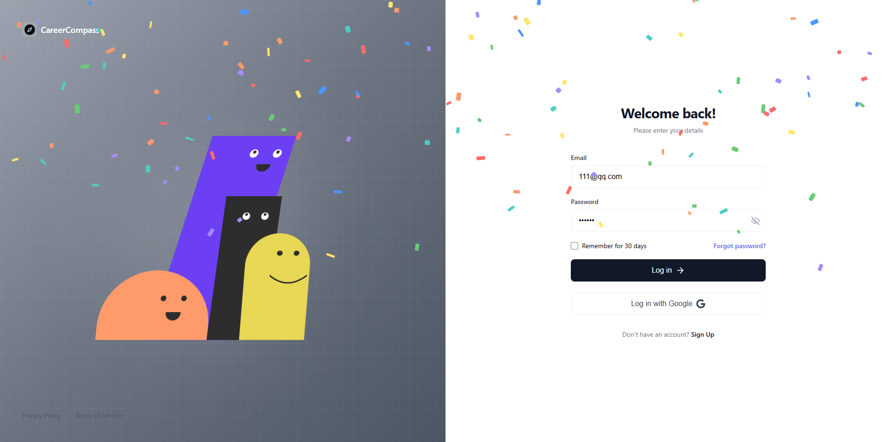

# 动画角色登录页面（非原创） - Vue 3 版本

一个充满趣味的交互式登录页面，四个可爱的动画角色会用眼睛跟随你的鼠标，并根据你的操作做出不同反应。


### 截图展示

<div align="center">
  
  
</div>

<div align="center">
  
  
</div>

## ✨ 功能特性

### 🎭 角色动画
- **四个彩色角色**：紫色、黑色、橙色、黄色，每个角色都有独特的形状和个性
- **眼睛跟踪**：所有角色的眼睛会实时跟随鼠标移动
- **随机眨眼**：每个角色独立的眨眼动画（3-7秒随机间隔）
- **身体倾斜**：角色身体会根据鼠标位置微微倾斜，增加互动感
- **入场动画**：页面加载时角色从底部优雅地升起

### 🔐 交互反馈
- **输入响应**：开始输入时，紫色和黑色角色会互相对视
- **密码隐藏**：隐藏密码时，紫色角色会紧张地向侧面倾斜
- **密码偷看**：显示密码时，紫色角色会偷偷瞄向密码框
- **登录失败**：失败时角色会露出悲伤表情（黑色角色眼睛下垂）
- **登录成功**：成功时会有彩色纸屑庆祝动画，角色眼睛缓缓向上看

### 📝 表单功能
- 邮箱和密码验证
- 密码显示/隐藏切换
- 记住我选项
- 错误提示信息
- 响应式设计

## 🚀 快速开始

### 安装依赖

```bash
npm install
```

### 启动开发服务器

```bash
npm run dev
```

访问 `http://localhost:5173` 查看效果

### 构建生产版本

```bash
npm run build
```

### 预览生产版本

```bash
npm run preview
```

## 📁 项目结构

```
animated-characters-login-page/
├── src/
│   ├── components/
│   │   ├── LoginPage.vue           # 登录页面主组件
│   │   ├── AnimatedCharacters.vue  # 四个角色的容器组件
│   │   ├── EyeBall.vue            # 眼球组件（带白色眼白）
│   │   └── Pupil.vue              # 瞳孔组件（纯黑色瞳孔）
│   ├── App.vue                    # 根组件
│   ├── main.js                    # 入口文件
│   └── style.css                  # 全局样式
├── PERFORMANCE_OPTIMIZATIONS.md   # 性能优化文档
├── index.html                     # HTML 模板
├── vite.config.js                 # Vite 配置
└── package.json                   # 项目配置
```

## 🛠️ 技术栈

- **Vue 3** - 使用 Composition API
- **Vite** - 快速的开发构建工具
- **原生 CSS** - 无需额外 UI 框架
- **性能优化**：
  - requestAnimationFrame 节流
  - 位置缓存减少 DOM 查询
  - GPU 加速（will-change）
  - 内存泄漏防护

## 🎨 组件说明

### AnimatedCharacters.vue
四个角色的容器组件，负责：
- 管理所有角色的位置和动画状态
- 处理鼠标跟踪和位置计算
- 控制眨眼、对视、偷看等交互逻辑
- 登录成功时的纸屑动画

### EyeBall.vue
带白色眼白的眼球组件，支持：
- 瞳孔跟随鼠标移动
- 眨眼动画
- 悲伤表情（眼睛变形）
- 强制视线方向（用于特定交互）

### Pupil.vue
纯黑色瞳孔组件，用于橙色和黄色角色：
- 更简洁的设计（无眼白）
- 跟随鼠标移动
- 支持眨眼效果

### LoginPage.vue
登录表单组件，包含：
- 邮箱和密码输入框
- 表单验证逻辑
- 密码显示/隐藏切换
- 与角色动画的状态同步

## ⚡ 性能优化

本项目经过精心优化，确保流畅的动画体验：

### 已实现的优化
1. **角色身体动画**
   - 缓存角色中心位置，减少 95% 的 DOM 查询
   - 使用 RAF 节流，稳定在 60fps
   - 只在窗口 resize 时更新缓存

2. **内存管理**
   - 纸屑动画 8 秒后自动清理
   - 防止多次登录导致的内存泄漏
   - 组件卸载时清理所有定时器和事件监听器

3. **渲染优化**
   - CSS `will-change` 提示 GPU 加速
   - Passive 事件监听器提升滚动性能
   - 合理使用 CSS transitions 而非 JS 动画

4. **眼球跟踪**
   - 保持实时 `getBoundingClientRect()` 调用以确保准确性
   - 因为角色身体会动态变形，眼球需要跟踪父容器变化

详细优化说明请查看 [PERFORMANCE_OPTIMIZATIONS.md](PERFORMANCE_OPTIMIZATIONS.md)

## 🎯 自定义配置

### 修改角色颜色

在 [AnimatedCharacters.vue](src/components/AnimatedCharacters.vue) 中修改角色的 `backgroundColor`：

```vue
<div
  class="character purple-character"
  :style="{
    backgroundColor: '#6C3FF5', // 修改紫色角色颜色
    // ...
  }"
>
```

### 调整眨眼频率

在 [AnimatedCharacters.vue](src/components/AnimatedCharacters.vue) 中修改：

```javascript
const schedulePurpleBlink = () => {
  const interval = Math.random() * 4000 + 3000 // 3-7秒随机间隔
  // ...
}
```

### 修改角色位置和尺寸

在 [AnimatedCharacters.vue](src/components/AnimatedCharacters.vue) 中调整：

```vue
<div
  :style="{
    left: '70px',    // 水平位置
    width: '180px',  // 宽度
    height: '400px', // 高度
    // ...
  }"
>
```

### 调整眼睛跟踪灵敏度

在 [EyeBall.vue](src/components/EyeBall.vue) 或 [Pupil.vue](src/components/Pupil.vue) 中修改 `maxDistance` prop：

```vue
<EyeBall
  :maxDistance="10"  // 增大数值提高移动范围
/>
```

## 🌐 浏览器支持

- ✅ Chrome / Edge (推荐)
- ✅ Firefox
- ✅ Safari
- ✅ Opera

需要支持 ES6+ 和 CSS3 动画的现代浏览器。

## 📸 效果预览

### 正常状态
- 角色眼睛跟随鼠标移动
- 随机眨眼动画
- 身体微微倾斜

### 输入状态
- 紫色和黑色角色互相对视
- 紫色角色身体向右倾斜

### 密码隐藏
- 紫色角色紧张地向侧面倾斜

### 密码显示
- 紫色角色偷偷瞄向密码框
- 其他角色看向左下方

### 登录失败
- 黑色角色眼睛变成悲伤形状
- 紫色和橙色角色嘴巴变成倒U形

### 登录成功
- 彩色纸屑从顶部飘落
- 所有角色眼睛缓缓向上看

## 🔧 开发说明

### 代码结构
- 使用 Vue 3 Composition API
- 组件化设计，职责分离
- 响应式状态管理
- 性能优化优先

### 关键技术点
1. **鼠标跟踪**：使用 `getBoundingClientRect()` 计算相对位置
2. **动画节流**：`requestAnimationFrame` 控制更新频率
3. **状态同步**：父子组件通过 props 传递状态
4. **CSS 动画**：使用 `transition` 和 `transform` 实现流畅动画

## 📝 许可证

MIT License - 可自由使用和修改

## 🙏 致谢

本项目灵感来源于 [CareerCompass](https://careercompassai.vercel.app/login) 的登录页面设计。

## 📮 反馈与贡献

欢迎提交 Issue 和 Pull Request！
